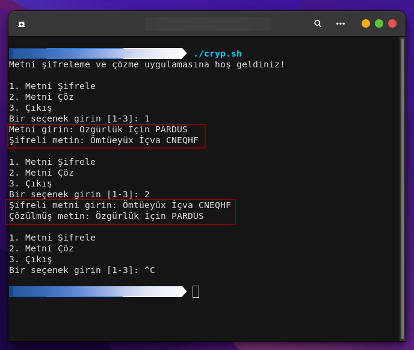

<a href="#">
    
</a>

# crypter
This script provides the user with options to encrypt and decrypt the text. The user selects the relevant option to encrypt or decrypt the text and makes the necessary entries.


Install Git Clone 

Github Package Must Be Installed On Your Device.
```bash
sudo apt install git  -y
```

----------------------------------
# Installation
Install Crypter
```bash
sudo git clone https://github.com/cektor/crypter.git
```
```bash
cd crypter/
```
```bash
sudo chmod +x crypter.sh
```
```bash
./crypter.sh
```


# Screenshot




